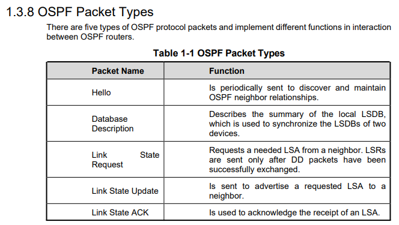

<h1>HCIA Cheatsheet<h1>

# OTHER

MTU - Maximal transit unit (for inteface)

Control plane: provides functions such as protocol processing, service processing, route calculation, forwarding control, service scheduling, traffic statistics collection, and system security. The control plane of a switch is used to control and manage the running of all network protocols. The control plane provides various network information and forwarding query entries required for data processing and forwarding on the data plane

IPv6 - OSPFv3

VRP - console, telnet, USB router conf (no FTP)

traceroute - ICMP 

**CODES**: TCP-6, UDP-17, ICMP-1

SNMP uses UDP

Message Age of STP root conf msg = 0

RSTP = STP after conf BDPU

> TODO: 4096 step where?,CAPWAP TOPOS + DHCP, ip classes, hybrid port, STP ports and ID

# OSI

# MAC 

IEEE - MAC 01-80-C2-xx-xx-xx (STP MULTICAST 8bit = 1, 7 - Local administrated addr)

? Terminal host - not multicast ?

# IPv4

32 bytes (24 mask as default)

# IPv6

ospf v3

# OSPF 

fields: priority, router ID[no 0?] (**HIGHER** is best)

**IPv6** - OSPFv3

>ospf 1
>
>area 0 | 0.0.0.0
>
>// ? no enable ?

Area 0 - backbone

> DR is elected by all routers in segment

adjaency(full) DR/BDR + all > neighbour (2way) DRO+DRO

> Statuses: 

types: broadcast, nbma, p2mp, p2p

packets: Hello, DD, LSR, LSU, LSAack (LSA - not packet - link state advertise)

# DHCP

> addresses can be reused

Packets (in time order): Discover-broadcast, offer-unicast, request-broadcast, ack-unicast 

# VLAN (802.q1)

**TPID** tag 0x8100 в TAG-ID .1q-frame (not Eth)

> PVID - port vlan id, Vlan_ID - frame vlan id

Kinds:

- Interface-based
- Mac-based

> // enable command?

canNOT contain STP, RSTP (stp dont understand virtual networks, so works badly)

can - OSPF, ARP

by default all ports in default VLAN (can be manually deleted)

> ACCESS:
>
> Eth2 (no Vlan_ID) -> Vlan_ID := PVID
>
> Vlan_ID == PVID -> Eth2 (no Vlan_ID)
>
> Vlan_id != PVID -> X_discard_X
>
> 
>
> TRUNK (inherits access):
>
> Eth2 -> Vlan_id -> check allow pass
>
> Vlan_id != PVID -> check allow pass
>
> Vlan_id == PVID -> Eth2

# STP + RSTP

doNOT work with vlan

**LOWER** is best

> RSTP = STP after conf BDPU

> In RSTP, a backup port can replace a faulty root port

Default Forward delay = **15 sec**

# WLAN

AP upgrade modes: AC, FTP, SFTP (no tftp)

**Authentication modes**: MAC, SN, no auth

DHCP + **option 43**

packet **Beacon** - AP **proactively** share SSID (**passive** STA scanning)

packet **Probe** - active STA scanning

> Config process
>
> 1 - AP obtains AC addr
>
> 2 - Establish CAPWAP
>
> 3 - AP access control

# ACL

# Eth-Trunk + CSS

Layer 2 and 3 both

LACP(DU) - link aggregation control protocol

LACP(DU): Device priority (default = **32768**), MAC, interface priority, port number

> LACP flags: synchronizing, collecting, distributing (111 - active, 000 - inactive)

Actor: **LOWER** system (device) priority, ? MAC ?

Interfaces: **LOWER** interfaces priorities of actor, port number

Same params on member interfaces: vlan, speed, duplex mode + load-balancing

___

by t̶̹̊r̵̺̬̐i̶̡̲̋c̶̟̈̐k̷̩̓s̷̯̾t̴̞̏ḙ̷̽̈́ṛ̷̾

all rights reserved (no)
