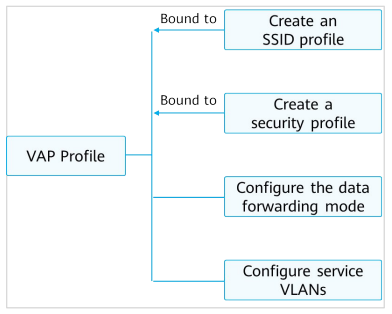

<h1>HCIA Cheatsheet<h1>

Take me to [pookie](#pookie)

# OTHER

- **Switch FLOODS (not discards) if MAC not found **
- **Switch discards if next port MAC = Source MAC**

MTU - Maximal transit unit (for interface)

- **Switch = isolate collision domains, join 1 broadcast domain**
- **Router = isolate broadcast & collision domains**

Control plane: provides functions such as protocol processing, service processing, route calculation, forwarding control, service scheduling, traffic statistics collection, and system security. The control plane of a switch is used to control and manage the running of all network protocols. The control plane provides various network information and forwarding query entries required for data processing and forwarding on the data plane

forwarding equivalence class (FEC) is a term used in Multiprotocol Label Switching (MPLS) to describe a set of packets with similar or identical characteristics which may be forwarded the same way

>File extensions:
>
>cc - system softaware
>
>cfg, dat, zip - config
>
>pat - patch
>
>bin - PAF (features and resources)

> 44.	(<SA>)The Point-to-Point Protocol (PPP) is a common data link layer protocol for wide area networks (WANs). Which of the following statements about PPP is false?
> + (FALSE) A.	The establishment of a PPP link goes through three phases: link layer negotiation, network layer negotiation, and authentication. 
> + B.	PPP uses the Link Control Protocol (LCP) to negotiate link control layer parameters.
> - C.	If PPP uses password authentication mode, negotiation packets are transmitted in plain text, which is insecure.
>
> + D.	PPP supports the Password Authentication Protocol (PAP) and Challenge Handshake Authentication Protocol (CHAP).

> (?) 52.	(<SA>)The Network Configuration Protocol (NETCONF) provides a mechanism for managing network devices. Which of the following statements about NETCONF is false?
>
> - A.	Yet Another Next Generation (YANG) is a data modeling language that standardizes NETCONF data content.
>
> - (FALSE) B.	If YANG files are not integrated into a device, the device does not support NETCONF.
> - C.	NETCONF messages are formatted using either JSON or XML. 
> - D.	NETCONF supports trial runs and rollback in case of errors.

In asynchronous transmission, data is transmitted byte by byte. Therefore, it is less efficient than synchronous transmission.

> IPv6 - OSPFv3
>
> IPv4 - OSPFv2

VRP - console, telnet, USB router conf *(no FTP)*

> simple switches doNOT isolate broadcast domains, but vlan or layer 3 can (usually routers do)

AAA - Authentication, Authorization, Accounting (Auth modes: hwtacacs | local (default) | radius)

FTP kinds: active, passive

Blackhole route / null route - key from routing loops

traceroute, ping - ICMP 

> Routes: direct (link layer protos), static (handmade), dynamic (ospf, is-is, etc.)

**TYPE CODES**: TCP-6, UDP-17, ICMP-1

**Ports:**

> SNMP uses UDP/161, UDP/162
>
> TFTP uses UDP/69
>
> FTP uses TCP/21 (commands), TCP/20 (data)
>
> SFTP uses SSH+TCP/22
>
> CAPWAP uses UDP ports 5246 (control channel) and 5247 (data channel)

Message Age of STP root conf msg = 0

RSTP = STP after conf BDPU

> TODO: 4096 step where?,CAPWAP TOPOS + DHCP, ip classes, hybrid port, STP ports and ID, eth2+1q frames, wifi standarts and default channels, ospf cost formulas, ospf statuses, STP
>
> 
>
> blackhole null route, SDN, OpenFlow

<a name="pookie">gg</a>

# OSI

# MAC 

IEEE - MAC 01-80-C2-xx-xx-xx (STP MULTICAST 8bit = 1, 7 - Local administrated addr)

? Terminal host - not multicast ?

# IPv4

32 bits (24 mask as default)

> Types: Unicast, Multicast, Broadcast

OSPFv2

# IPv6

Multicast addresses: https://support.huawei.com/enterprise/en/doc/EDOC1000177796/16e69f9c/multicast-addresses

128 bits

> Types: Unicast, Multicast, Anycast

ospf v3

MULTICAST starts with FF

> ?Stages?
>
> - address configuration 
> - duplicate address detection (DAD)
> - address resolution

An IPv6 packet has three parts: an IPv6 basic header, one or more IPv6 extension headers, and an upper-layer protocol data unit (PDU). An upper-layer PDU is composed of the upper-layer protocol header and its payload, which maybe an ICMPv6 packet, a TCP packet, or a UDP packet.

> Parts:
>
> - IPv6 basic header
> - one or more IPv6 extension headers
> - upper-layer protocol data unit (PDU)

# OSPF 

fields: priority, router ID[no 0?] (**HIGHER** is best)

> Network types
>
> - Point-to-point
> - Point-to-multipoint
> - Broadcast Multiaccess (BMA)
> - Virtual links
> - Nonbroadcast Multiaccess (NBMA)

**LSDB is same on DR and BDR (not DRO)**

> Authentification
>
> - area
> - interface

> display ospf lsdb 

**IPv6** - OSPFv3

**IPv4** - OSPFv2

>ospf 1
>
>area 0 | 0.0.0.0
>
>// ? no enable ?

Area 0 - backbone

> DR is elected by all routers in segment

adjaency(full) DR/BDR + all > neighbour (2way) DRO+DRO

types: broadcast, nbma, p2mp, p2p

packets: Hello, DD, LSR, LSU, LSAack (LSA - not packet - link state advertise)

# DHCP

> addresses can be reused

> DHCPv6 devices are identified by DUIDs, and each DHCPv6 server or client can have only one DUID.

Packets (in time order): Discover-broadcast, offer-unicast, request-broadcast, ack-unicast 

# VLAN (802.q1)

ID from 1 to 4095 (cisco)

**TPID** tag 0x8100 in TAG-ID .1q-frame (not Eth) **4 bytes tag**

> PVID - port vlan id, Vlan_ID - frame vlan id

Kinds:

- Interface-based
- Mac-based

> // enable command?

canNOT contain STP, RSTP (stp doNOTunderstand virtual networks, so works badly)

can - OSPF, ARP

by default all ports in default VLAN (can be manually deleted)

> ACCESS:
>
> Eth2 (no Vlan_ID) -> Vlan_ID := PVID
>
> Vlan_ID == PVID -> Eth2 (no Vlan_ID)
>
> Vlan_id != PVID -> X_discard_X
>
> 
>
> TRUNK (inherits access):
>
> Eth2 -> Vlan_id -> check allow pass
>
> Vlan_id != PVID -> check allow pass
>
> Vlan_id == PVID -> Eth2

# STP + RSTP

**LOWER** is best (default port priority **128**)

TCN - Topology Change Notification

doNOT work with vlan

Only 1 root port on non-root device

RSTP optimizes STP in many aspects, provides faster convergence, and is compatible with STP.

> RSTP = STP after conf BDPU
>

> In RSTP, a backup port can replace a faulty root port

Default Forward delay = **15 sec**

> RSTP prots:
>
> - root port
> - designated port
> - alternate port
> - backup port

# WLAN

AP upgrade modes: AC, FTP, SFTP *(no tftp)*

**Authentication modes**: MAC, SN (serial number), no auth *(no password)*

DHCP + **option 43**

packet **Beacon** - AP **proactively** share SSID (**passive** STA scanning)

packet **Probe** - active STA scanning

**BSSID** = func(APs MAC)

> Topologies:
>
> - in-path
> - off-path
>   - direct forwarding (local)
>   - **tunnel forwarding (centralized) - Data through AC**

> Config process
>
> 1 - AP obtains AC addr
>
> 2 - Establish CAPWAP
>
> 3 - AP access control

# ACL

Default increment = 5 , CAN be changed

# Eth-Trunk, iStack+ CSS

Layer 2 and 3 both

> flow-based load balancing

LACP(DU) - link aggregation control protocol

LACP(DU): Device priority (default = **32768**), MAC, interface priority, port number

> LACP flags: synchronizing, collecting, distributing (111 - active, 000 - inactive)

Actor: **LOWER** system (device) priority, ? MAC ?

Interfaces: **LOWER** interfaces priorities of actor, port number

Same params on member interfaces: vlan, speed, duplex mode + load-balancing

___

iStack and CSS provide the same functions, despite their different names and implementation mechanisms.

# SDN

> Characteristics:
>
> - centralized control
> - forwarding-control separation
> - open programmable interfaces
> - (distributed forwarding)

___

by t̶̹̊r̵̺̬̐i̶̡̲̋c̶̟̈̐k̷̩̓s̷̯̾t̴̞̏ḙ̷̽̈́ṛ̷̾

all rights reserved (no)
